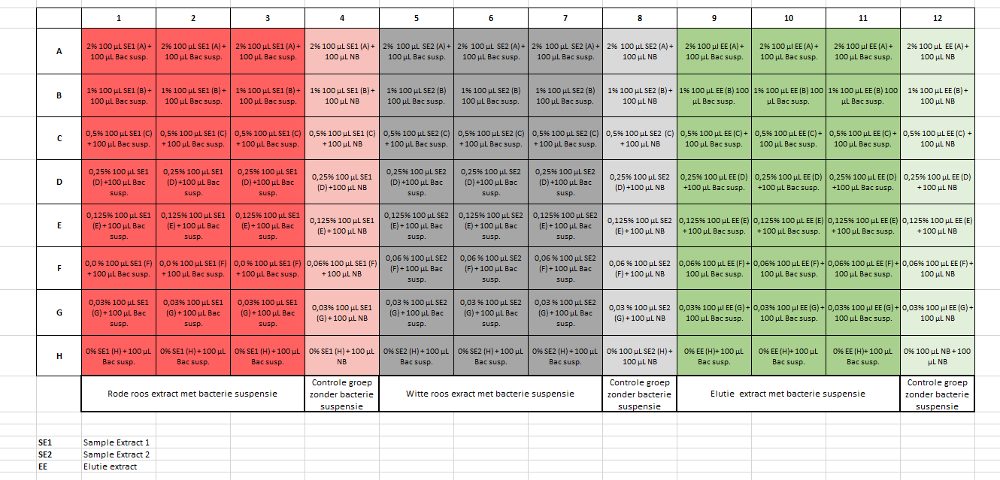

# Deafault plate setup

A default plate setup is as ahown below:



# User Settings

```{r}
# Set organism
organism <- "My Organism"

# Set file and folder
filename <- "2020-01-30.csv"
excel_file <- "2020-01-30.xlsx"
folder <- "sample_data"

# Set samples
sample_1 <- "Sample1"
sample_2 <- "Sample2"
sample_3 <- "Elution"

# Set columns (sample#_replicate).
# This is for user input convenience. 
# Sample and replicate will be separated later using dplyr::separate
col_1 <- "1_1" 
col_2 <- "1_2" 
col_3 <- "1_3" 
col_4 <- "1_c" 
col_5 <- "2_1" 
col_6 <- "2_2" 
col_7 <- "2_3" 
col_8 <- "2_c" 
col_9 <- "3_1" 
col_10 <- "3_2" 
col_11 <- "3_3" 
col_12 <- "3_c" 

# Set dilutions
row_1 <- 2
row_2 <- 1
row_3 <- 0.5
row_4 <- 0.25
row_5 <- 0.13
row_6 <- 0.06
row_7 <- 0.03
row_8 <- 0

# Set line colors
linecolors <- c("#FF3633", "#FF8933", "#FCFF33", "#62FF33", "#33FFEB", "#33A7FF", "#5F33FF", "#EA33FF")

```

# Imports

```{r}
library(Rmisc)
library(tidyverse)
```

# Converting user input

```{r}
samples <- c(sample_1, sample_2, sample_3)
columns <- c("row", col_1, col_2, col_3, col_4, col_5, col_6, col_7, col_8, col_9, col_10, col_11, col_12)
dilution_series <- factor(c(row_1, row_2, row_3, row_4, row_5, row_6, row_7, row_8))
filepath <- file.path(folder, filename)
filepath_excel <- file.path(folder, excel_file)
group1 <- c('1_1', '1_2', '1_3', '1_c')
group2 <- c('2_1', '2_2', '2_3', '2_c')
group3 <- c('3_1', '3_2', '3_3', '3_c')
```

# Loading the data

## Read from Excel in `xlsx` format

```{r}
library("readxl")
df <- read_excel(filepath_excel, sheet = 2) %>% slice(-1:-1) #drop the first row 

skip <- 14 #each time, 14 rows of plate info that will be skipped
collect <- 8 #there are 8 rows of OD data that I will keep
reps <- nrow(df) %/% (skip + collect) #number of repetitions
index <- rep(0:(reps - 1), each = collect) * (skip + collect) + (1 : collect) + skip
df <- df[index, ] #collect the blocks of OD data
df <- df[, 1:13]
colnames(df) <- columns
df[2:13] <- lapply(df[2:13], function(x) as.numeric(as.character(x)))
df
```

## Read from a `csv` file.

```{r}
# df <- read_csv2(filepath,
#                 col_types = cols(row = 'c', .default = col_double()),
#                 col_names = columns) %>% #Using col_names also removes the empty columns
#   slice(-1:-2) #drop the first two rows
# 
# skip <- 14 #each time, 14 rows of plate info that will be skipped
# collect <- 8 #there are 8 rows of OD data that I will keep
# reps <- nrow(df) %/% (skip + collect) #number of repetitions
# index <- rep(0:(reps - 1), each = collect) * (skip + collect) + (1 : collect) + skip
# df <- df[index, ] #collect the blocks of OD data
# df
```


# Add timepoint and dillution columns

```{r}
num_of_timepoints <- nrow(df) / 8 - 1
timepoints_actual <- seq(0, (10 * num_of_timepoints), by = 10)
timepoints <- rep(timepoints_actual, each = 8)
dilutions <- rep(dilution_series, times = num_of_timepoints + 1)

df <- mutate(df, timepoint = timepoints, dilution = dilutions) %>%
  select(1, timepoint, dilution, everything())
#View(df)
```

# Make tidy

```{r}
#Use dplyr to make tidy df tables
#Need to gather at multiple levels, hence the function.
generateTidy <- function(df_t, selector){
  df_t <- df_t %>% 
    select(row, timepoint, dilution, all_of(selector)) %>%
    gather(selector[1], selector[2], selector[3], key = 'sample', value = 'OD_S') %>%
    separate(sample, into = c('sample', 'replicate')) %>%
    select(1:3, sample, replicate, 'OD_S', selector[4]) %>%
    dplyr::rename('OD_C' = selector[4]) %>%
    mutate(OD_N = OD_S - OD_C)
  return(df_t)
}

df_tidy_s1 <- generateTidy(df, group1)
df_tidy_s2 <- generateTidy(df, group2)
df_tidy_s3 <- generateTidy(df, group3)
#View(df_tidy_s1)
```

# Summary Data

```{r}
#Use the summarySE package to calculate the mean, SD, SE and CI data at once.
vars <- c("dilution", "timepoint")
stat.sample1 <- summarySE(df_tidy_s1, measurevar="OD_N", groupvars=vars)
stat.sample2 <- summarySE(df_tidy_s2, measurevar="OD_N", groupvars=vars)
stat.sample3 <- summarySE(df_tidy_s3, measurevar="OD_N", groupvars=vars)
#View(stat.sample3)
```

# Set-up plots

```{r, echo=F}

base.string <- sprintf("(%s) file: %s",organism, filename)
title.string.s1 <- sprintf("%s %s", samples[1], base.string)
title.string.s2 <- sprintf("%s %s", samples[2], base.string)
title.string.s3 <- sprintf("%s %s", samples[3], base.string)

generatePlot <- function(sample, title.string){
  ggplot(data = sample, mapping = aes(x = timepoint, y = OD_N, group=dilution)) + 
  geom_point(aes(color = dilution)) + 
  geom_line(aes(color = dilution)) +
  scale_color_manual(values = linecolors) +
  labs(x = "Time (min)", y = "OD", title = title.string) +
  geom_errorbar(aes(ymin = OD_N - sd, ymax = OD_N + sd), width = .05, colour = "#A9A9A9") +
  theme(plot.title = element_text(size=12))
}

```

# Generate Plots

## Plot 1

```{r, echo=F}
generatePlot(stat.sample1, title.string.s1)
```

## Plot 2

```{r, echo=F}
generatePlot(stat.sample2, title.string.s2)
```

## Plot 3

```{r, echo=F}
generatePlot(stat.sample3, title.string.s3)
```

# Controls (can be used to find a contamination)

```{r}
generatePlotControl <- function(sample, title.string){
  ggplot(data=sample, mapping = aes(x = timepoint, y = OD_C, group = dilution)) + 
  geom_point(aes(color = dilution)) + 
  geom_line(aes(color = dilution)) +
  scale_color_manual(values = linecolors) +
  labs(x = "Time (min)", y = "OD", title = paste("Control:", title.string, sep = " ")) +
    ylim(0, 0.5) +
    theme(plot.title = element_text(size=12))
}
```

## Plot 1

```{r, echo=F}

generatePlotControl(df_tidy_s1, title.string.s1)

```

## Plot 2

```{r, echo=F}

generatePlotControl(df_tidy_s2, title.string.s2)

```

## Plot 3

```{r, echo=F}

generatePlotControl(df_tidy_s3, title.string.s3)

```

# Each data series separate (can be used to find a contamination)

```{r}
generatePlotEachLine <- function(sample, title.string){
  ggplot(data=sample, mapping = aes(x = timepoint, y = OD_N, group = dilution)) + 
  geom_point(aes(color = dilution)) + 
  scale_color_manual(values = linecolors) +
  labs(x = "Time (min)", y = "OD", title = paste("Each sample separate:", title.string, sep = " ")) +
    theme(plot.title = element_text(size=12))
}
```

## Plot 1

```{r, echo=F}

generatePlotEachLine(df_tidy_s1, title.string.s1)

```

## Plot 2

```{r, echo=F}

generatePlotEachLine(df_tidy_s2, title.string.s2)

```

## Plot3

```{r, echo=F}

generatePlotEachLine(df_tidy_s3, title.string.s3)

```

# Growthcurver

See this link: [growthcurver](https://cran.r-project.org/web/packages/growthcurver/vignettes/Growthcurver-vignette.html)
On Github: [Growthcurver](https://github.com/cran/growthcurver)

## data transformat for growthcurver

```{r}
library(growthcurver)
# First spread the tidy data as growthcurver uses a plate setup:
spread_data <- function(df, value_to_spread){
  gc_df <-  df[, c(1, 2, 4)] %>% spread(key = "dilution", value = value_to_spread)
  colnames(gc_df)[1] <- "time"
  gc_df$time <- gc_df$time / 60
  return(gc_df)
}

gc_df_s1 <- spread_data(stat.sample1, value_to_spread = "OD_N") #growth curver data frame sample 1
gc_df_s2 <- spread_data(stat.sample2, value_to_spread = "OD_N") #growth curver data frame sample 2
gc_df_s3 <- spread_data(stat.sample3, value_to_spread = "OD_N") #growth curver data frame sample 3

# Replace negative values with zeros. This is done because of modeling problems  
gc_df_s1[2:9] <- replace(gc_df_s1[2:9], gc_df_s1[2:9] < 0, 0)
gc_df_s2[2:9] <- replace(gc_df_s2[2:9], gc_df_s2[2:9] < 0, 0)
gc_df_s3[2:9] <- replace(gc_df_s3[2:9], gc_df_s3[2:9] < 0, 0)
tail(gc_df_s3)
```

## Single selection

```{r}
column_selector <- 2 # select a dilution. 1 is time and not a dilution!
gc_fit <- SummarizeGrowth(gc_df_s1$time, gc_df_s1[[column_selector]], bg_correct = "none")
gc_fit
```
## Plot single curve

```{r}

plot(gc_fit, ylab = "OD", xlab = "time (hours)", main = paste("Concentration:", colnames(gc_df_s1)[column_selector], sep = " "))

```
## Properties of the gcfit object returned from the SummarizeGrowth function:

The gcfit object returned from SummarizeGrowth also contains further metrics 
summarizing the growth curve data.
Explanation on object:
- k:     The carrying capacity parameter
- k_se:  The standard error of the carrying capacity parameter
- k_p:   The p value of the carrying capacity parameter
- n0:    The initial population size
- n0_se: The standard error of the initial population size
- n0_p:  The p value of the initial population size
- r:     The growth rate
- r_se:  The standard error of the growth rate
- r_p:   The p value of the growthrate
- sigma: Residual standard error from non-linear least squares fit of the model to the data
- df:    Degrees of freedom
- t_mid: The time at the inflection point of the logistic curve (occurs at half of the carrying capacity)
- dt:    The maximum doubling time, obtained by evaluating the the unrestrained growth of the population with growth rate r
- auc_l: The area under the curve of the fitted logistic equation from time 0 to time t
- auc_e: The area under the curve of the measurements.
- note: Feedback on common problems with fitting the logistic curve to the data

```{r}
paste("Concentration:", colnames(gc_df_s1)[column_selector], sep = " ")
str(gc_fit$vals)
```

## Get them all


#### Sample 1


```{r}
gc_out_s1 <- SummarizeGrowthByPlate(gc_df_s1, plot_fit = TRUE, 
                                 plot_file = "./plots/gc_plots_s1.pdf", bg_correct = "none")
gc_out_s1
#View(gc_out_s1)
```

### Sample 2


```{r}
gc_out_s2 <- SummarizeGrowthByPlate(gc_df_s2, plot_fit = TRUE, 
                                 plot_file = "./plots/gc_plots_s2.pdf", bg_correct = "none")
gc_out_s2
#View(gc_out_s2)
```

### Sample 3

```{r}
gc_out_s3 <- SummarizeGrowthByPlate(gc_df_s3, plot_fit = TRUE, 
                                 plot_file = "./plots/gc_plots_s3.pdf", bg_correct = "none")
gc_out_s3
#View(gc_out_s3)
```

## Without backgroud correction

```{r}
vars <- c("dilution", "timepoint")
sample1_no_corr <- summarySE(df_tidy_s1, measurevar="OD_S", groupvars=vars)
sample2_no_corr <- summarySE(df_tidy_s2, measurevar="OD_S", groupvars=vars)
sample3_no_corr <- summarySE(df_tidy_s3, measurevar="OD_S", groupvars=vars)


gc_df_no_corr_s1 <- spread_data(sample1_no_corr, value_to_spread = "OD_S") 
gc_df_no_corr_s2 <- spread_data(sample2_no_corr, value_to_spread = "OD_S") 
gc_df_no_corr_s3 <- spread_data(sample3_no_corr, value_to_spread = "OD_S") 
#gc_df_no_corr_s1

```

### Sample 1 (no correction)

```{r}
gc_out_no_corr_s1 <- SummarizeGrowthByPlate(gc_df_no_corr_s1, plot_fit = TRUE, 
                                 plot_file = "./plots/gc_plots_no_corr_s1.pdf", bg_correct = "none")
gc_out_no_corr_s1
```

### Sample 2 (no correction)

```{r}
gc_out_no_corr_s2 <- SummarizeGrowthByPlate(gc_df_no_corr_s2, plot_fit = TRUE, 
                                 plot_file = "./plots/gc_plots_no_corr_s2.pdf", bg_correct = "none")
gc_out_no_corr_s2
```

### Sample 3 (no correction)

```{r}
gc_out_no_corr_s3 <- SummarizeGrowthByPlate(gc_df_no_corr_s3, plot_fit = TRUE, 
                                 plot_file = "./plots/gc_plots_no_corr_s3.pdf", bg_correct = "none")
gc_out_no_corr_s3
```


# Growthcurve package 

See this link: [growthcurve](https://github.com/briandconnelly/growthcurve)
NB: Do not confuse with the `growthcurver` package

```{r}
library(growthcurve)
```

```{r}
rep1 <- filter(df_tidy_s1, sample == 1, dilution == 0, replicate == 1)
myfit <- fit_growth(rep1, timepoint, OD_N, model = "gompertz")
plot(myfit, show_raw = TRUE, show_maxrate = TRUE, show_asymptote = FALSE, ylab = "OD (AU)", xlab = "Time (min)")
```


```{r}
test2 <- filter(df_tidy_s1, sample == 1, dilution == 0)
ggplot(data = test2, aes(x = timepoint, y = OD_N, color = replicate)) +
    geom_point(shape = 1) +
    ylab("OD (AU)") +
    xlab("Time (min)") +
    stat_growthcurve()
```


The end...
